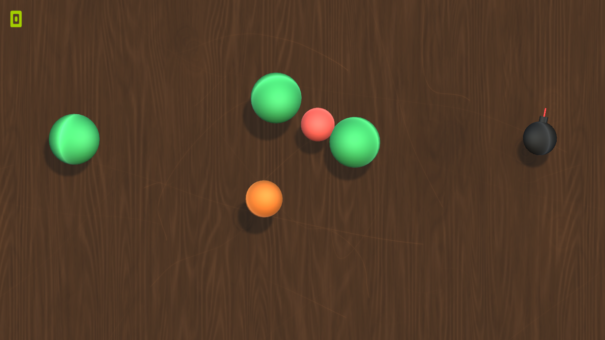

# Unity-Fruit-Ninja

In December 2022 In Yazdan Panah University, for advanced programming class, the students were tasked to create a simple game using c# and unity.

> Fruit Ninja is a mobile game developed by Halfbrick Studios that released in April 2010 on the iOS App Store. In Fruit Ninja, the player slices fruit with a blade controlled via the touch screen. As the fruit is thrown onto the screen, the player swipes their finger across the screen to create a slicing motion, attempting to slice the fruit in half.

## Game Elements

The game had some factors such as:
- Fruit(Several types)
- Bomb
- Blade
